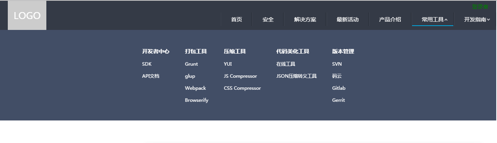
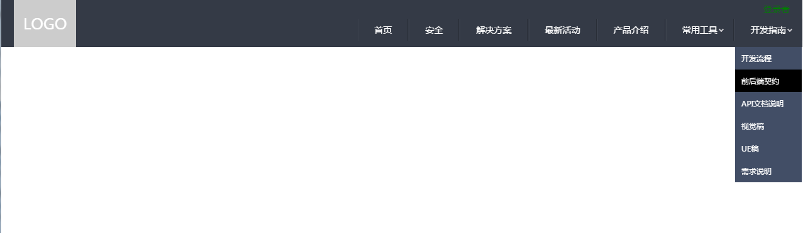

# vuenav

> A Vue.js project

## Build Setup

``` bash
# install dependencies
npm install

# serve with hot reload at localhost:8080
npm run dev

# build for production with minification
npm run build

# build for production and view the bundle analyzer report
npm run build --report
```

For a detailed explanation on how things work, check out the [guide](http://vuejs-templates.github.io/webpack/) and [docs for vue-loader](http://vuejs.github.io/vue-loader).

##使用vue实现的一个简易二级导航

**技术栈**

* vue + vue-router + less

**功能看图**

横向的子菜单:



纵向的子菜单:



**布局方案：**

```html
<!-- guidemenu: 纵向菜单 -->
<!-- toolmenu：横向菜单 -->
<ul class="nav">
  <li><a href="">首页</a></li>
  <li><a href="">安全</a></li>
  <li><a href="">开发指南<b></b></a>
    <ul class="guidemenu" v-show="isguide">
      <li><a href="">开发流程</a></li>
      <li><a href="">前后端契约</a></li>
      <li><a href="">API文档说明</a></li>
    </ul>
  </li>
</ul>
<div class="toolmenu">
  <ul class="menu">
    <li>开发者中心</li>
    <li><a href="">SDK</a></li>
    <li><a href="">API文档</a></li>
  </ul>
  <ul class="menu">
    <li>打包工具</li>
    <li><a href="">Grunt</a></li>
    <li><a href="">glup</a></li>
  </ul>
</div>
```

`guidemenu`  : 纵向菜单的定位范围以父级`li`为准，所以直接写在`li`标签下。

`toolmenu` ：横向菜单的定位以body为准，所以直接写在最外面。


**实现方案：**

当鼠标移动到`li`上时,显示子菜单，针对于`guidemenu`，只需要判断父级`li` 移入移出即可。`isguide`作为开关显示隐藏子菜单。

```html
<li @mouseover="isguide=true" @mouseout="isguide=false"><a href="">开发指南<b></b></a>
  <ul class="guidemenu" v-show="isguide">
    <li><a href="">开发流程</a></li>
    <li><a href="">前后端契约</a></li>
    <li><a href="">API文档说明</a></li>
  </ul>
</li>
```

针对于`toolmenu` 。因为子菜单于`li`标签是脱离开的，所以需要两个地方判断。一：在`li`标签上移入时**或** 在`ul.guidemenu` 标签上移入时显示子菜单。二：在`li`标签上移出**并**在`ul.guidemenu`标签上也移出时隐藏子菜单。

```html
<li @mouseover="istool=true" @mouseout="istool=false"><a href="">常用工具<b></b></a></li>
<!-- 子菜单 -->

<div class="toolmenu" v-show="istool||ismenu" @mouseover="ismenu=true" @mouseout="ismenu=false">
      <ul class="menu">
        <li>开发者中心</li>
        <li><a href="">SDK</a></li>
        <li><a href="">API文档</a></li>
      </ul>
      <ul class="menu">
        <li>打包工具</li>
        <li><a href="">Grunt</a></li>
        <li><a href="">glup</a></li>
      </ul>
  </div>
```

**细节处理**  


导航栏的底部有间隙，`li`包括的实际范围是蓝色部分，也就是说mouseover能作用的范围就是蓝色部分，这样的话当鼠标放置于红框框的地方，子菜单就不会显示。这里的处理方法是借用伪元素填充了这段距离。

```scss
.nav{
  >li{
    &:after{
      position: absolute;
      content: '';
      height:20px;left:0;right:0;
    }
 }
```

结束======================== ☝( ◠‿◠ )☝=============================================


